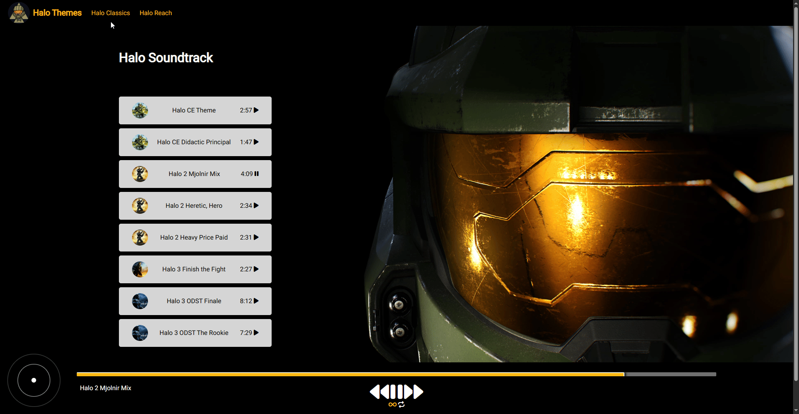

# 🎮 MyHaloThemeApp

**MyHaloThemeApp** is a web-based music player dedicated to playing iconic Halo soundtracks. Built using HTML, CSS, and JavaScript, this application offers a nostalgic experience for Halo fans by featuring a curated list of themes accompanied by dynamic visuals.

## 🚀 Features

- 🎵 **Play Halo Themes**: Enjoy a selection of your favorite Halo soundtracks.
- 🔀 **Playlist Switcher**: Easily switch between two different Halo-themed playlists using navbar buttons.
- 🎧 **Interactive UI**: Engaging interface with responsive audio controls.
- 🌌 **Dynamic Backgrounds**: Immersive visuals that enhance the listening experience.
- 🖼️ **Halo-Themed Design**: Incorporates iconic imagery from the Halo universe.


## 🛠️ Technologies Used

- **HTML5**: Structure of the web pages.
- **CSS3**: Styling and layout.
- **JavaScript (ES6)**: Interactive features and audio control.

## 🎬 Demo



## 📦 Getting Started

To run the application locally:

1. **Clone the repository**:
   ```bash
   git clone https://github.com/arijitkayal-gm/Myhalothemeapp.git


## 🙏 Acknowledgements

 - 💡 CodeWithHarry – for inspiring the foundational idea and helpful tutorials on JavaScript-based music players.
 - 🎮 Bungie / 343 Industries – creators of the Halo franchise, for the amazing music that inspired this app.

